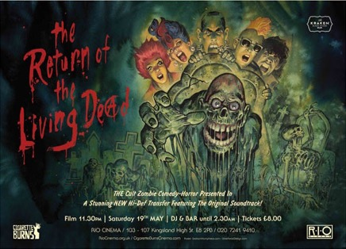
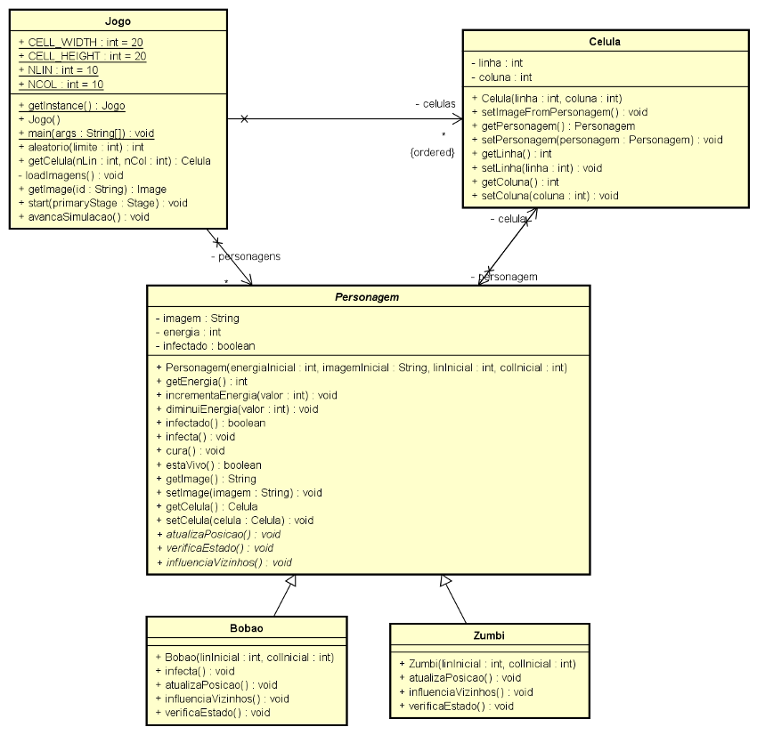

## **
Programação Orientada a Objetos
**
## **
Trabalho Final – 2021/2**

## **
Apocalipse zumbi - Simulador
**
#

Zumbis são uma figura popular na cultura pop e de entretenimento. As histórias sobre zumbis provavelmente têm origem na cultura Afro-Caribenha, altamente espiritualizada, pontuada por rituais de magia incluindo Vodu entre outros. 

No cinema os zumbis se popularizaram no filme “A Noite dos Mortos Vivos” de 1968. Os zumbis do cinema são diferentes dos da cultura Vodu. Normalmente tem origem em algum tipo de infecção ou exposição à radiação e, uma vez infectados, passam a ter atração por carne humana ou por cérebros humanos como em “A Volta dos Mortos Vivos” de 1985 (ver figura 1).

*Figura 1 - Cartaz do filme “A Volta dos Mortos Vivos” de 1985*

**1. Objetivo**

O objetivo deste trabalho é consolidar os conhecimentos sobre programação orientada a objetos estudados ao longo da disciplina: herança/polimorfismo, lambdas/streams, coleções, arquivos e interfaces gráficas. 

Para isto, será desenvolvido um simulador de ataques zumbis usando os pressupostos da cultura popular dos filmes de zumbi. Deve-se definir um modelo para a infecção zumbi e simular este modelo de maneira a observar seu comportamento: se os zumbis são eliminados, se o sistema se equilibra ou se os zumbis são extintos junto com o resto da humanidade (se os zumbis não encontram ninguém para devorar morrem de inanição depois de um tempo).

**2. Simulador**

O simulador deverá utilizar como base um “tabuleiro” quadrado de pelo menos 15 posições de lado. Sobre esse tabuleiro, “peças” representando humanos ou zumbis deverão se mover segundo regras específicas e, sempre que se encontrarem, deverá ser calculado o resultado da iteração (morte do humano, morte do zumbi, infecção do humano, diminuição da resistência de um ou de outro etc, etc). A cada “rodada” de simulação o sistema deve verificar o posicionamento de cada uma das peças dispostas sobre o tabuleiro e processar seu comportamento (deslocamento, interação, morte etc). O número de peças de cada tipo no início da simulação deve ser configurável e sua posição inicial pode ser configurável ou sorteada.

O simulador deve ser capaz de exibir a situação das peças sobre o tabuleiro. Além disso deve ser capaz de exibir informações com a quantidade de cada tipo de personagem ao longo do tempo além da contagem do próprio tempo simulado. A atualização da visualização deve ocorrer toda a vez que o botão “avançar” do simulador for pressionado. O botão avançar deverá disparar a simulação de uma rodada de simulação. 

O simulador deverá dispor de, no mínimo, os seguintes controles:

- **(3,5 pt)** Configuração de personagens (permite configurar a quantidade inicial de cada tipo de personagem);
  - Você deve ter no mínimo cinco tipos de personagens (3 normais e 2 zumbis). 
- **(0,5 pt)** Avanço da simulação (corresponde ao botão “avançar”);
  - **(1 pt) Bônus**: adicionar a possibilidade de o usuário definir o número de rodadas que a simulação será executada a cada avanço
- **(1 pt)** Reinicialização da simulação (faz com que a simulação volte ao passo zero);
- **(0,5 pt)** Salvamento da simulação (permite salvar o estado atual da simulação de maneira que possa ser recarregado futuramente);
- **(1,5 pt)** Recuperação de simulação (permite carregar dados de uma simulação previamente salva de maneira que ela possa continuar do ponto em que parou);
- **(0,5 pt)** Contexto (deve exibir um texto com o contexto da simulação, ou seja, regras nas quais se baseiam o comportamento dos diferentes personagens);
- **(0,5 pt)** Encerramento do programa.

**3. Contexto**

Faz parte do trabalho a definição textual do contexto (que deve ser exibido a partir do acionamento do controle correspondente). O contexto não deve ser apresentado apenas como um conjunto de regras, e sim apresentar o roteiro na qual estas regras se baseiam. Deve definir os diferentes tipos de personagens que interagem no tabuleiro, suas regras de movimentação e regras de interação.

Exemplo: “Em uma pequena cidade do interior do Pará o derramamento acidental de agrotóxicos próximo à fonte de captação de água da cidade transformou 20% da população em zumbis. Estes deslocam-se aleatoriamente pela cidade mordendo a população normal. Quando atacados, 70% das pessoas conseguem escapar sem sequelas, 20% ficam infectadas com o “vírus zumbi” e só irá se transformar em um zumbi se for atacado uma segunda vez e 10% transformam-se em zumbi imediatamente. Entre os 70% de humanos que conseguem se safar, 20% destes conseguem eliminar o zumbi que os atacou. Zumbis que não eliminam ninguém por mais de 20 unidades de tempo morrem de inanição” (no caso cada rodada de simulação corresponde a uma unidade de tempo). Note que este contexto “exemplo” não corresponde ao código inicial apresentado.

**4. Implementação**

O simulador deve ser desenvolvido em Java e a interface com o usuário deve ser desenvolvida usando a API JavaFX a partir do código base fornecido pelo professor.

O código base contém a estrutura do simulador e um exemplo básico. Os personagens (tanto zumbis como humanos) deverão ser derivados a partir da classe “Personagem”. A inicialização do jogo bem como a criação da interface com o usuário deverá ser feita na classe “Jogo”. O exemplo demonstra um simulador simples que inclui os personagens “Bobao” e “Zumbi”. O personagem “Bobao” não faz nada, fica parado o tempo todo. Se um “Zumbi” passa em uma “casa” vizinha a um “Bobao” então o “Bobao” é infectado. Uma vez infectados os “Bobao” perdem 2 unidades de vida a cada passo de simulação. Como esta versão não possui nenhum personagem capaz de curá-los, eles terminam por morrer após 5 rodadas.

Para obter o código base / exemplo acesse o endereço: <https://github.com/aagustini/zumbis-inicial>. Acesse “*Clone or Download*” e escolha a opção “Download .zip”. A Figura 2 apresenta o diagrama de classes do código base.

Atenção – se utilizar o GitHub (ou outro repositório público) durante o desenvolvimento do trabalho (até o momento da apresentação) seu projeto deve ser mantido em um repositório privativo e o professor convidado como colaborador do projeto (usuário: aagustini ou <alexandre.agustini@pucrs.br>).

Observações:

- O código inicial utiliza uma ferramenta de gerenciamento de código ([*maven](maven)*)*, que deve estar instalado na sua máquina: <https://maven.apache.org/install.html>. 
- Para executar o projeto deve-se utilizar o gerenciador - abra um terminal na pasta principal do projeto e execute:*   **mvn compile javafx:run**
- Teste o código disponibilizado *ASAP* e no caso de dúvida/dificuldades contate o professor.

**5. Entrega e avaliação**

O trabalho pode ser desenvolvido de maneira individual ou em grupos de até 4 integrantes. Os fontes e o executável do trabalho, juntamente com instruções e todos os arquivos necessários para sua execução deverão ser entregues na sala *moodle* indicada pelo professor até a data indicada na sala. Todos os arquivos necessários à execução do projeto deverão ser entregues compactados em um único arquivo em formato *.zip*.  

Além dos pontos já enunciados neste texto, serão considerados ainda na avaliação a qualidade do código fonte e a diversidade de comportamento dos personagens, o uso adequado dos conceitos de orientação a objetos e programação funcional vistos em aula, a riqueza da história e a qualidade da interface com o usuário **(2 pt)**. 

O trabalho deverá ser apresentado para a turma na aula do dia 02/12/2021 (a aula do dia 06/12/2019 é reservada para o caso de faltar tempo para a apresentação de todos os grupos, mas a entrega dos trabalhos deve ser feita impreterivelmente até o dia 2) e todos os integrantes do grupo deverão ser capazes de operar o simulador e de responder perguntas sobre a implementação. Os grupos devem preparar uma apresentação *de 7 minutos* (apresentar pelo menos o contexto, tipos de personagens e execução do simulador), seguida de um tempo de discussão.

*Figura 2 - Diagrama de classes do código exemplo*
